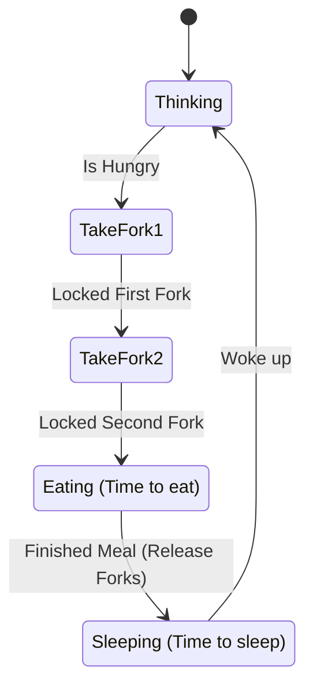
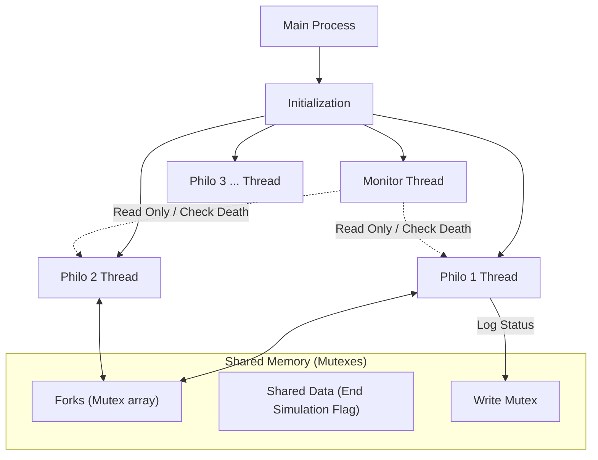

# Philosophers


<br />
<div align="center">
  <h3 align="center">I eat, therefore I sleep.</h3>
  <p align="center">
    42 Cursus Project - スレッドとミューテックスによる並行処理の学習
    <br />
    <a href="#about-the-project"><strong>Explore the docs »</strong></a>
    <br />
    <br />
    <a href="#usage">View Usage</a>
    ·
    <a href="#issues">Report Bug</a>
  </p>
</div>

<details>
  <summary>Table of Contents</summary>
  <ol>
    <li><a href="#about-the-project">About The Project</a></li>
    <li><a href="#features">Features</a></li>
    <li><a href="#architecture">Architecture & Logic</a></li>
    <li>
      <a href="#getting-started">Getting Started</a>
      <ul>
        <li><a href="#prerequisites">Prerequisites</a></li>
        <li><a href="#installation">Installation</a></li>
      </ul>
    </li>
    <li><a href="#usage">Usage</a></li>
    <li><a href="#project-structure">Project Structure</a></li>
    <li><a href="#authors">Authors</a></li>
  </ol>
</details>

## About The Project

**Philosophers** は、古典的な計算機科学の問題である「食事する哲学者の問題 (Dining Philosophers Problem)」を解決するシミュレーションプログラムです。
Unixのスレッド (`pthread`) とミューテックス (`mutex`) を使用し、リソース（フォーク）の競合、データレースの防止、デッドロックの回避、そして正確な時間の管理を実装しています。

<div align="center">
  
</div>

## Features

- [x] **マルチスレッド実装**: 各哲学者を独立したスレッドとして動作させ、並行処理を実現
- [x] **デッドロック回避**: 偶数番目と奇数番目の哲学者でフォークを取る順序を変えるアルゴリズムを採用
- [x] **データレース防止**: `safe_functions` ラッパーとMutexにより、共有リソースへのアクセスを厳密に管理
- [x] **正確な時間管理**: `gettimeofday` を用いたミリ秒単位の経過時間計測と、ズレを補正する `precise_usleep` の実装
- [x] **監視スレッド**: 哲学者の餓死や食事回数制限を監視する独立したMonitorスレッド

## Architecture & Logic

### 1. 哲学者のライフサイクル (Philosopher Routine)

各哲学者は以下のループを繰り返します。



### 2. デッドロック回避の仕組み (Deadlock Prevention)

円卓上のデッドロックを防ぐため、哲学者のID（偶数・奇数）によってフォークを取る優先順位を変更しています。

* **奇数ID**: 右のフォーク -> 左のフォーク
* **偶数ID**: 左のフォーク -> 右のフォーク

これにより、全員が同時に「右手のフォーク」を持って待機する状態（円環待機）を防ぎます。

### 3. スレッド構成 (Thread Structure)



## Getting Started

### Prerequisites

* GCC or Clang
* Make
* Pthread library

### Installation

1.  リポジトリをクローンします。
    ```sh
    git clone [https://github.com/](https://github.com/)[your-username]/philosophers.git
    ```
2.  ディレクトリに移動します。
    ```sh
    cd philosophers/philo
    ```
3.  コンパイルします。
    ```sh
    make
    ```

## Usage

生成された `philo` 実行ファイルに引数を渡して実行します。

```bash
./philo [number_of_philosophers] [time_to_die] [time_to_eat] [time_to_sleep] [number_of_times_each_philosopher_must_eat]
```

* `number_of_philosophers`: 哲学者の数（=フォークの数）
* `time_to_die`: 最後の食事からこの時間（ミリ秒）経過すると死亡する
* `time_to_eat`: 食事にかかる時間（ミリ秒）
* `time_to_sleep`: 睡眠にかかる時間（ミリ秒）
* `[number_of_times...]`: (オプション) 各哲学者が最低何回食事をすればシミュレーションを終了するか

### Execution Examples

**基本動作（無限に続く）:**
```bash
./philo 5 800 200 200
```
* 5人の哲学者が、死ぬまでの猶予800ms、食事200ms、睡眠200msで生活します。誰も死なずにシミュレーションが続きます。

**死ぬパターン:**
```bash
./philo 1 800 200 200
```
* 1人の哲学者はフォークを2本持てないため、800ms後に死亡します。

**食事回数指定:**
```bash
./philo 5 800 200 200 7
```
* 全員が7回食事を完了するとシミュレーションが終了します。

## Project Structure

```text
philo/
├── Makefile           # ビルド設定
├── philo.h            # ヘッダーファイル（構造体定義など）
├── main.c             # エントリーポイント
├── init.c             # メモリ確保、スレッド・Mutex初期化
├── parse.c            # 引数のパースとエラーチェック
├── dinner.c           # 哲学者のメインルーチン (eat, sleep, think)
├── monitor.c          # 監視スレッド (death check)
├── safe_functions.c   # pthread/mutex関数のラッパー (エラー処理付き)
├── utils.c            # 時間取得 (gettime) などのユーティリティ
├── synchro_utils.c    # スレッド同期用ヘルパー
├── getter_setter.c    # Thread-safeな変数の読み書き
└── write.c            # ログ出力 (Mutex保護付き)
```

## Authors

* **[yotakagi]** - *Implementation* - [Profile](https://github.com/yotakagi42)
